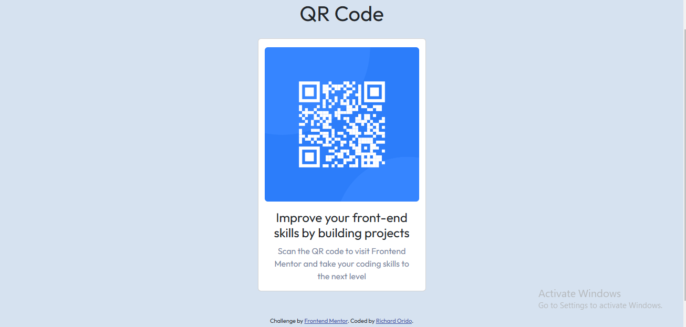

# Frontend Mentor - QR code component solution

This is a solution to the [QR code component challenge on Frontend Mentor](https://www.frontendmentor.io/challenges/qr-code-component-iux_sIO_H). Frontend Mentor challenges help you improve your coding skills by building realistic projects.

## Table of contents

- [Overview](#overview)
  - [Screenshot](#screenshot)
  - [Links](#links)
- [My process](#my-process)
  - [Built with](#built-with)
  - [What I learned](#what-i-learned)
  - [Continued development](#continued-development)
  - [Useful resources](#useful-resources)
- [Author](#author)

## Overview

### Screenshot

### Links

- Solution URL: [Solution](https://github.com/richie-omondi/qr-code.git)
- Live Site URL: [Live Site](https://richie-omondi.github.io/qr-code/)

## My process

### Built with

- Semantic HTML5 markup
- CSS custom properties
- Bootstrap 5
- Mobile-first workflow

### What I learned

I learned how to use Bootstrap to quickly come up with a card that I can use to add the QR code image and then begin styling it using different classes. I also learned how to implement semantic HTML5 to improve code readabilty and accessibility.

### Continued development

I want to work on bringing my implementations closer to the designs given.

### Useful resources

- [Bootstrap 5 docs](https://getbootstrap.com/)

## Author

- Website - [Richard](https://github.com/richie-omondi)
- Frontend Mentor - [@richie-omondi](https://www.frontendmentor.io/profile/richie-omondi)
- Twitter - [@richard_orido](https://www.twitter.com/richard_orido)
